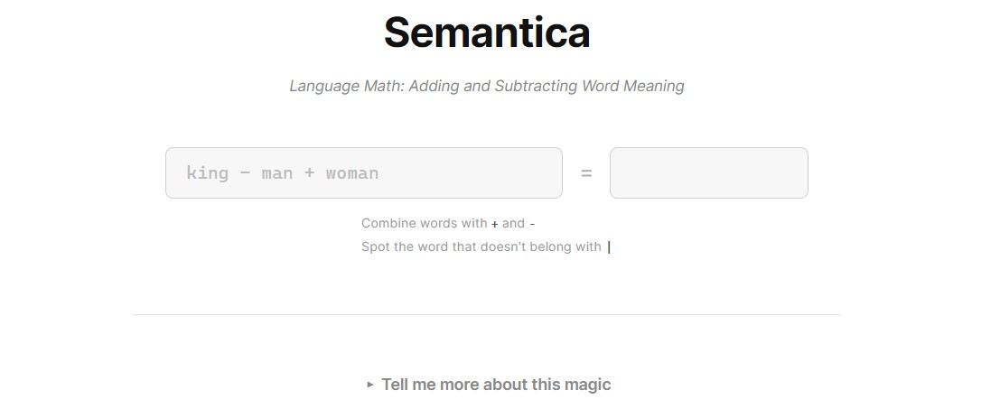

# Semantica

## Introduction
Semantica is a navigational tool for the hidden "map" of human language. It treats language not as a sequence of letters, but as a high-dimensional geometric space where word meaning is defined by physical coordinates.

Try [Semantica](https://huggingface.co/spaces/kiryha-krysko/Semantica) on Hugging Face

---

## Test and Update on Hugging Face
#### Test locally
Open Command Line Window in the Semantica folder.

Run: `python -m uvicorn app.main:app --host 127.0.0.1 --port 8000`

#### Puch Changes to HF
- Stage your changes: `git add .`
- Commit them locally: `git commit -m "Describe your changes"`
- Push to Hugging Face: `git push hf main`

---

## The Theory: How Words Become Space

### 1. The Language of Coordinates
Humans understand words through context and emotion. Computers, however, only understand numbers. To bridge this gap, we use **Word Embeddings**. 

Imagine every word in the English language is a floating point in a dark, infinite void. 
* Words with similar meanings (like *Ocean* and *Sea*) are clustered tightly together.
* Opposites or unrelated words (like *Apple* and *Justice*) are miles apart.

### 2. The 300-Dimensional "Point Cloud"
In a 3D software like Houdini or Maya, a point is defined by 3 coordinates: $(X, Y, Z)$. 
Semantica operates in a **300-dimensional space**. Every word is a vector—a "pointer" from the center of the universe $(0,0,0...)$ to a specific coordinate in this massive 300-axis grid. These extra dimensions allow the computer to capture subtle nuances: one axis might represent "masculinity," another "royalty," and another "temperature."

### 3. Static Embeddings (GloVe)
This project utilizes **GloVe (Global Vectors for Word Representation)**. These are "static" embeddings, meaning the computer has pre-scanned billions of lines of text (from Wikipedia and the web) to calculate these coordinates based on **co-occurrence**. If two words frequently appear near each other in the real world, they are moved closer together in the vector space.

---

## Semantic Arithmetic & Spatial Logic
The true magic of Semantica is that because words are numbers, you can perform math on them to uncover cultural relationships and navigate linguistic clusters.

### 1. Relational Analogies (`+` and `-`)
By adding and subtracting vectors, you can "transport" meanings across the map.

$$Vector(\text{"King"}) - Vector(\text{"Man"}) + Vector(\text{"Woman"}) \approx Vector(\text{"Queen"})$$

By subtracting the "man" vector from "king," we mathematically strip away the concept of masculinity while retaining "royalty." Adding "woman" applies femininity to that royal essence, landing us at the coordinates for "queen."

### 2. Outlier Detection: The "Odd One Out" (`|`)
The `|` operator allows you to perform **Spatial Filtering**. If you provide a list of words, Semantica will identify which word mathematically "doesn't belong."

**Example:** `apple | banana | meat | orange` $\rightarrow$ **"meat"**

**How it works:**
1. **The Centroid:** Semantica calculates the "Center of Gravity" (the average coordinate) for all words in your list.
2. **The Distance Scan:** It then measures the distance from each word to that center.
3. **The Outlier:** Words like *apple*, *banana*, and *orange* exist in a tight "Fruit Cluster." *Meat*, however, is located in a distant part of the 300D space. Semantica flags the word with the highest distance from the group as the outlier.
3. **The Outlier:** Words like *apple*, *banana*, and *orange* exist in a tight "Fruit Cluster." *Meat*, however, is located in a distant part of the 300D space. Semantica flags the word with the highest distance from the group as the outlier.
